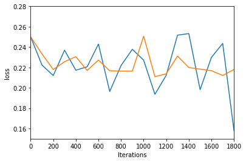

# Similarity-Detection 

## Model

A single layer Siamese LSTM is used as a model for finding similarity between two sentences.

## Dataset

quora dataset

## Result

Accuracy:79%

## Training Vs Validation LOSS graph

